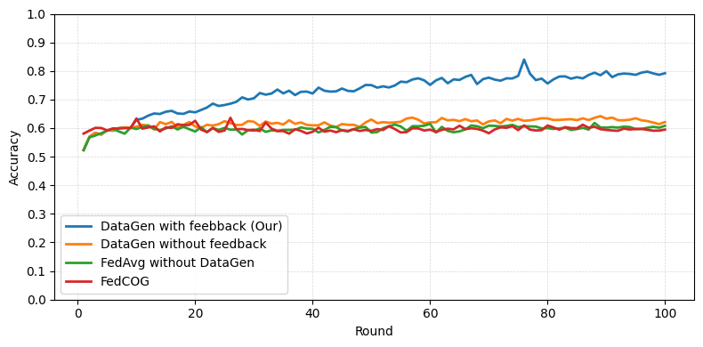
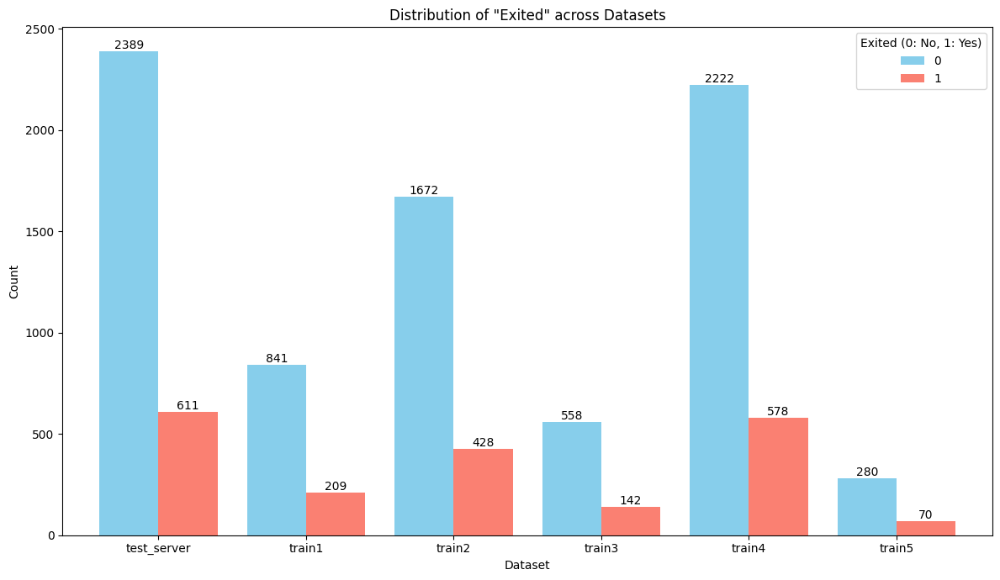

<p align="center">
  
</p>

# Domain Adaptation of Federated Learning by Data Generation and Server Feedback

[](https://doi.org/10.1007/978-981-95-4960-3_22)
[](https://doi.org/10.1007/978-981-95-4960-3_22)
[](https://caodien2003.github.io/flgenai/)
[](https://flower.ai/)

Reference implementation of **"Domain Adaptation of Federated Learning by Data Generation and Server Feedback"**, published in *MIWAI 2025* (LNAI 16354, pp. 272–283, Springer Nature Singapore).

📄 **[Paper](https://doi.org/10.1007/978-981-95-4960-3_22)** &nbsp;·&nbsp; 🌐 **[Project page](https://caodien2003.github.io/flgenai/)**

Phuong-Anh Vu¹, Kim-Tinh Phan¹, Cao-Dien Nguyen¹, Tien-Dung Cao¹ ✉, Le Trieu Phong², Ngoc-Thai Nguyen³
<sub>¹ Tan Tao University · ² NICT, Tokyo · ³ Viettel Solutions</sub>

---

## Overview

In federated learning, the server often holds a test set that represents the **target domain**, while clients train on local data drawn from somewhere else. That gap — domain shift — is what degrades the global model.

This framework closes it with a feedback loop that never moves raw data:

1. **The server analyses the shift.** It aggregates the client models (FedAvg), evaluates all of them on its target test set, and, for each test sample, picks the model that predicts the correct label with the highest confidence.
2. **It distils lightweight feedback.** From that model it computes a **Grad-CAM** or **SHAP** attribution and keeps only the *top-k* most important features plus the label — a statistical summary, not a sample.
3. **It targets each client's own errors.** For every client, the server sends back the feedback for the *top-m* samples that client misclassified most confidently.
4. **Clients generate data from the feedback.** The important features are written into a noisy input at their recorded positions and passed through a generative model — TVAE for tabular, a diffusion model for images, an LLM for text. Local training then runs on real + synthetic data.

Feedback is not produced every round. It is triggered once enough rounds have passed, once client models start overfitting locally, or once the global model's accuracy on the server test set plateaus or drops.

<p align="center">
  
  <br>
  <sub><b>Text (News Category, 42 classes).</b> FedAvg, FedCOG and generation-without-feedback plateau near 0.6; feedback-guided generation keeps climbing to ≈ 0.8.</sub>
</p>

---

## What's in this repository

| Track | Feedback signal | Generator | Model | Status |
| --- | --- | --- | --- | --- |
| [`tabular/`](tabular/) | SHAP | TVAE (SDV) | 5-layer MLP | ✅ included |
| [`text/`](text/) | Grad-CAM over tokens | Gemma-2B-it | DistilBERT | ✅ included |
| Image (CIFAR-10) | Grad-CAM | Diffusion (DDPM) | ResNet-18 | ❌ not in this repo |

> The CIFAR-10 experiment from Section 3.2 of the paper is reported in the results below but its code is not part of this repository.

```
.
├── docs/                     # GitHub Pages project page
│   ├── index.html
│   └── assets/
├── tabular/                  # SHAP feedback + TVAE generation
│   ├── server_tabular.py     # FedAvg, evaluation, plateau detection, SHAP feedback
│   ├── client_tabular.py     # local training, feature restore, TVAE sampling + filtering
│   ├── dataset/7030/         # server test set + 5 non-IID client shards
│   ├── tvae_gen.pkl          # pre-trained TVAE generator
│   └── README.md             # full setup, config and troubleshooting guide
└── text/                     # Grad-CAM feedback + Gemma generation
    ├── server_textdata.py    # FedAvg, Grad-CAM token attribution, checkpoints
    ├── client_textdata.py    # DistilBERT training + prompt-driven headline generation
    ├── data/                 # server test set + 5 non-IID client shards
    └── README.md
```

---

## Quickstart

### Tabular — Bank Customer Churn

```bash
cd tabular
conda create -n flgenai-tabular python=3.10 -y && conda activate flgenai-tabular
pip install -r requirements.txt

# terminal 1 — server (listens on 0.0.0.0:9000)
python server_tabular.py

# terminal 2..n — one process per client shard
python client_tabular.py --client-id client1 --train-csv dataset/7030/train1.csv \
    --server-address 127.0.0.1:9000 --log-dir logs/exp01
```

Requires Python 3.8–3.11 — `torch==2.2.2` has no wheel for 3.12. Use the same `--log-dir` on server and clients so one run's artefacts land together. See [`tabular/README.md`](tabular/README.md) for every config key, the log layout, and troubleshooting (SDV pickle version, numpy BitGenerator, WSL2 OOM).

### Text — News Category

```bash
cd text
pip install -r requirements.txt

python server_textdata.py --num_rounds 30 --ckpt_every 5   # terminal 1
python client_textdata.py                                  # terminal 2..n
```

Before the first run, set the paths at the top of both scripts — `TEST_CSV` in the server, `CSV_PATH` and `DRIVE_ROOT` in the client — and supply your own Hugging Face token (Gemma is a gated model). Set `USE_GRADCAM_FEEDBACK = False` to reproduce the generation-without-feedback baseline. Details in [`text/README.md`](text/README.md).

---

## Results

### Tabular — Bank Customer Churn, 30 rounds

| Method | Accuracy | Precision | Recall | F1-Score |
| --- | ---: | ---: | ---: | ---: |
| **DataGen with Feedback (ours)** | **0.9280** | **0.7770** | **0.9067** | **0.8369** |
| FedAvg without DataGen | 0.8320 | 0.6072 | 0.4959 | 0.5459 |
| DataGen without Feedback | 0.8243 | 0.5802 | 0.4975 | 0.5357 |
| Centralized Training | 0.8433 | 0.4484 | 0.6732 | 0.5383 |

Our method exceeds even centralized training. The paper attributes this to the distributional mismatch itself: the server's test set differs from the client training data, so the gain reflects adaptation to the target distribution rather than a better fit to the training pool.

### Image — CIFAR-10, 50 rounds

Ten non-IID subsets, one held out as the target set per run. Accuracy of our method — consistently above FedCOG, generation-without-feedback, and FedAvg:

| Target set 1 | Target set 5 | Target set 10 |
| ---: | ---: | ---: |
| **92.6%** | **91.1%** | **94.3%** |

### Text — News Category, 100 rounds

Baselines plateau near **0.6**; feedback-guided generation reaches ≈ **0.8** (figure above).

### Running time

| Track | Feedback cost | Generation cost | Notes |
| --- | --- | --- | --- |
| Tabular | ≈ 50 s | — | ≈ 150 s per client per round; < 50 min for 30 rounds |
| CIFAR-10 | ≈ 80 s / client | up to 900 s | 200 images per class; generation fires in ~16–18 of 50 rounds |
| Text | ≈ 2 h (Grad-CAM) | ≈ 5 h / 2,500 samples | vs. 1.5 h without feedback; FedAvg round ≈ 743 s, FedCOG ≈ 1,260 s |

---

## Data

Both tracks ship pre-split non-IID shards — one server test set (the target domain) and five client shards.

| Shard | Tabular (rows) | Text (rows) |
| --- | ---: | ---: |
| Server test set | 3,000 | 10,979 |
| Client 1 | 1,050 | 48,740 |
| Client 2 | 2,100 | 69,641 |
| Client 3 | 700 | 31,426 |
| Client 4 | 2,800 | 28,196 |
| Client 5 | 350 | 20,517 |

Tabular shards come from a 70/30 split of the [Bank Customer Churn](https://www.kaggle.com/datasets/radheshyamkollipara/bank-customer-churn/) dataset (19 features + the `Exited` label). Text shards come from the [News Category](https://www.kaggle.com/datasets/rmisra/news-category-dataset) dataset, Dirichlet-partitioned with β = 0.05 so each shard has a different set of dominant categories across the 42 classes.

<p align="center">
  
  <br>
  <sub>Label distribution across the tabular shards — uneven in both size and class balance.</sub>
</p>

---

## Privacy

- **No client data is shared.** Clients exchange only model weights; their local data never leaves them, and synthetic data is generated locally.
- **Feedback is an abstraction, not a sample** — masked SHAP features (tabular) or salient token–position pairs (text), where positions are coarse (`beginning` / `middle` / `end`).
- **One caveat in the tabular implementation:** next to the masked SHAP entries, `server_tabular.py` also sends the matching rows of *the server's own test set* as a `reference` payload, which the client uses to fill in the masked values. That is server-side target-domain data, not client data — but it goes further than the summaries-only description in the paper, so review it before running against a sensitive target set.

The paper notes differential privacy as future work for putting quantifiable guarantees on the feedback signal.

---

## Citation

```bibtex
@inproceedings{vu2026domain,
  author    = {Vu, Phuong-Anh and Phan, Kim-Tinh and Nguyen, Cao-Dien and
               Cao, Tien-Dung and Phong, Le Trieu and Nguyen, Ngoc-Thai},
  title     = {Domain Adaptation of Federated Learning by Data Generation
               and Server Feedback},
  booktitle = {Multi-disciplinary International Conference on Artificial
               Intelligence (MIWAI 2025)},
  series    = {Lecture Notes in Artificial Intelligence},
  volume    = {16354},
  pages     = {272--283},
  publisher = {Springer Nature Singapore},
  year      = {2026},
  doi       = {10.1007/978-981-95-4960-3_22}
}
```

---

## Acknowledgements

This research is supported by the Tan Tao University (TTU) Foundation for Science and Technology Development under Grant No. TTU.RS.25.102.003. The work of L. T. Phong is supported in part by the JST CREST Grant JPMJCR21M1, Japan.

Built with [Flower](https://flower.ai/), [SHAP](https://github.com/shap/shap), [SDV](https://docs.sdv.dev/sdv), [DistilBERT](https://huggingface.co/docs/transformers/en/model_doc/distilbert) and [Gemma](https://huggingface.co/docs/transformers/en/model_doc/gemma).

## Contact

- Tien-Dung Cao (corresponding author) — dung.cao@ttu.edu.vn
